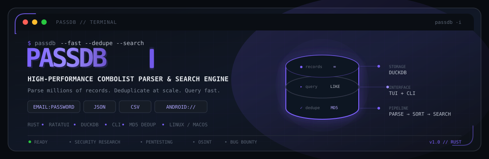

# PassDB

<div align="center">


<p align="center">
  
</p>

### High‑performance combolist parser, deduplicator, and search engine

**Built for handling massive credential datasets** – parse millions of `email:password` lines, JSON, CSV, and more – with an **interactive TUI** and a **fast DuckDB backend**.

**Designed for** security researchers, penetration testers, OSINT analysts, bug-bounty hunters, and anyone who needs to manage large credential collections **legally and efficiently**.

<br/>

[](LICENSE)
[](https://www.rust-lang.org/)
[](https://github.com/LeFaucheur0769/PassDB/stargazers)
[](https://github.com/LeFaucheur0769/PassDB/network/members)
[](https://github.com/LeFaucheur0769/PassDB/issues)
[](https://github.com/LeFaucheur0769/PassDB/commits/main)

<br/>

 &nbsp;
 &nbsp;
 &nbsp;
 &nbsp;


<br/>

<a href="#installation"></a>&nbsp;
<a href="#quick-commands"></a>&nbsp;
<a href="#configuration"></a>

</div>

---

## Contents

- [Why PassDB?](#why-passdb)
- [Key Features](#key-features)
- [Installation](#installation)
- [Quick Commands](#quick-commands)
  - [Interactive TUI](#interactive-tui)
  - [Command-Line Interface (CLI)](#command-line-interface-cli)
- [Configuration](#configuration)
- [Architecture](#architecture)
- [Contributing](#contributing)
- [License](#license)

---

## Why PassDB?

- **⚡ Blazing fast** – written in Rust, uses DuckDB for storage and querying; handles hundreds of millions of rows with ease.
- **🖥️ Interactive TUI** – a full‑screen terminal interface built with `ratatui` for comfortable navigation and progress monitoring.
- **🤖 CLI headless mode** – scriptable for automation and integration into pipelines.
- **📦 Intelligent parsing** – automatically detects and imports:
  - `email:password`, `user:pass`, `url:login:pass`
  - `android://` URIs
  - JSON (single objects or arrays)
  - CSV with header detection (supports `,`, `;`, `\t`)
  - French‑style CSV (`M., Mme.` format)
- **💾 Built‑in deduplication** – MD5 hashing prevents re‑processing the same file, saving time and space.
- **🔍 Fast search** – query by email or username with instant results across millions of records.
- **🛠️ Configurable** – all paths and behaviours are set in a simple `passdb.yml` file.
- **🧱 Modular** – clean separation of parsing, sorting, searching, and UI layers, making it easy to extend.

---

## Key Features

### 🖥️ Interactive TUI
Launch with `passdb -i`. The main menu gives you:
- **Add a combolist** – select files from your import directory, watch hashing and import progress, pause/resume/skip.
- **Search a combolist** – type an email or username, get results instantly.
- **Tools** (coming soon) – clean duplicates, manage databases.

**TUI controls:**  
`↑`/`↓` navigate, `Enter` select, `q`/`Esc` go back.  
During import: `p` pause/resume, `s` skip current file, `c` clear logs.

### 🧠 CLI Mode
Run non‑interactive searches:
```bash
passdb -e "admin@example.com"
```
Supports full argument parsing for automation.

### 🔄 Smart File Processing
- **Hash deduplication** – each file is MD5‑hashed; if already imported, it's skipped.
- **Multi‑format parser** – handles various delimiters, quotes, and structures.
- **Batch commit** – transactions commit every 5M rows for optimal performance.

### 🗃️ Powerful Database
Uses DuckDB with:
- In‑memory or persistent storage.
- Full SQL querying (future extensions).
- Parallel processing and memory limits tuneable.

### 📁 Headless Operations
The same core engine drives a non‑interactive orchestrator for pipelines (planned for future releases).

---

## Installation

Requires **Rust 1.70+** and **Cargo**. Works on Linux and macOS (Windows is not supported).

### From source (recommended)

```bash
# 1 – clone the repo
git clone https://github.com/LeFaucheur0769/PassDB.git
cd PassDB

# 2 – build in release mode
cargo build --release

# 3 – (optional) install the binary to your PATH (you must add passdb.yml to the same directory/provide a configuration file)
sudo cp target/release/passdb /usr/local/bin/
```

Now you can run `passdb` from anywhere.


### Development setup

```bash
cargo build
cargo run -- --help
```

---

## Quick Commands

### Interactive TUI

```bash
passdb -i
```

From the main menu:
- **Add a combolist** – pick files from your `import/` directory.
- **Search a combolist** – enter an email or username.

### Command-Line Interface (CLI)

| Command | Description |
|---------|-------------|
| `passdb -e "user@example.com"` | Search for that email (prints results) |
| `passdb -c custom.yml` | Use a different config file |
| `passdb -i` | Launch the interactive TUI |
| `passdb -t` | Run internal tests |
| `passdb -v` / `-d` | Enable verbose / debug output |
| `passdb -q` | Suppress output (quiet mode) |
| `passdb --help` | Show all options |

---

## Configuration

PassDB uses a YAML configuration file, default `passdb.yml`. On first run it checks and creates necessary directories.

Example configuration:

```yaml
debug: false
db_location: "db/"                     # where the DuckDB and hashdb live
create_db_in_toolFolder: true          # keep everything inside project folder
import_location: "import/"             # folder to scan for new combolists
export_results_location: "export/"     # output directory for search results
print_result_export_file: false        # also print to console when exporting
check_if_valid_combolist: true
nbr_of_check_per_file: 10
file_to_sort_location: "to_sort/"
file_to_sort_not_txt_files: "to_sort/not_txt/"
file_urlloginpass_dir: "to_sort/url_login_pass/"
add_file: false
```

All paths are relative to the binary’s working directory unless absolute.

---

## Architecture

The application is organised into several modules:

- **`main.rs`** – entry point, CLI parsing, and initialisation.
- **`tui/`** – the interactive terminal UI (screen stack, contexts, screens).
- **`sorter/`** – core parsing logic: file hashing, format detection, DuckDB insertion.
- **`search/`** – query engine against the DuckDB database.
- **`init/`** – setup, config validation, folder creation.
- **`logging/`** – structured logging with levels and formatting.

Data flow:
1. User selects a file (via TUI or CLI).
2. File is MD5‑hashed; if hash exists, skip.
3. File is parsed line by line (or JSON) into structured `Contact` rows.
4. Rows are committed to DuckDB in batches.
5. Search queries are run via SQL `LIKE` with limit.

---

## Contributing

Contributions are welcome! Please open an issue or pull request.

- **Adding a new parser?** Extend the `Sort` struct and the parsing logic.
- **Improving the TUI?** Look at `tui/screens/`.
- **Adding commands?** Extend the CLI arguments in `main.rs`.

See [CONTRIBUTING.md](CONTRIBUTING.md) for guidelines.

> **Important:** Use this tool only on data you own or are legally authorised to test.

---

## License

This project is licensed under the MIT License – see the [LICENSE](LICENSE) file for details.

---

*Your favourite combolist manager – now in Rust.*
